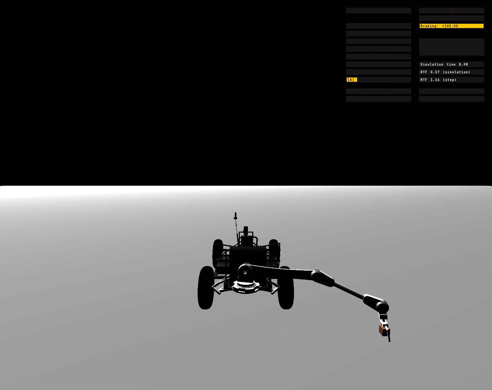

# lunar-manip

A [Project Chrono](https://projectchrono.org/) (PyChrono) demo of a lunar rover
(LRV / Polaris wheeled vehicle) with a **gripper arm rigidly attached to the
back of the chassis**, standing (braked) on flat terrain.

The demo is a **record/replay** of a rock placement, run as two simulations:

- **Sim 1 (headless):** pick a random target behind the arm (polar: θ∈[90°,270°],
  r∈[2,3] m, at the fixed grab height of 0.22 m above ground), drive the
  end-effector there with inverse kinematics, let it settle, and **record** the
  four joint angles and the gripper-center position (midpoint of the two
  fingers' centers of mass).
- **Sim 2 (visualized):** rebuild the same scene **with a rock placed at the
  recorded gripper-center position** (`build_scene(rock_pos=...)`) and **replay**
  the recorded angles. Recording the *actual* settled pose (vs. the IK target)
  absorbs IK residual error and dynamic sag. Once the pose settles, the demo
  finishes the last mile: it **closes the gripper fingers** around the rock,
  **locks the rock to the end-effector** (`ChLinkLockLock` via
  `gripper.add_lock()`), and **lifts it** by ramping the shoulder joint
  (theta 2) up to 60°.

`LRV_Arm` and the inverse-kinematics solver come from the `model` package.



## Layout

```
lunar-manip/
├── scenarios/
│   └── LRV_Arm.py          # the demo: two-sim record/replay rock placement
├── model/
│   ├── arm_model.py        # LRV_Arm — the gripper arm (SolidWorks import + motors)
│   └── inverseKin.py       # RobotArmInverseKinematicsSolver
└── data/
    ├── lrv_robotarm/       # arm SolidWorks export (lrv_arm.py) + mesh shapes
    ├── rocks/              # rock2.obj (Curiosity rock mesh from chrono's data)
    └── vehicle/            # Chrono data root for the demo (see "Data paths")
        ├── LRV/            # Polaris vehicle JSONs + meshes
        ├── terrain/        # lunar_env_12.obj terrain mesh
        ├── colormaps/, fonts/, skybox/   # Chrono visualization assets
```

## Setup

Create a dedicated conda environment:

```bash
conda create -n chrono python=3.12
conda activate chrono
conda install projectchrono::pychrono -c conda-forge
conda install scipy -c conda-forge      # needed by model/inverseKin.py
```

(Equivalently: `conda env create -f environment.yml`.)

## Run

```bash
conda activate chrono
python scenarios/LRV_Arm.py
```

Sim 1 runs headless first (a couple of seconds) to record the pose, then an
Irrlicht window opens for sim 2 showing the arm replaying that pose onto a rock
placed at the recorded spot, closing the gripper (t ≈ 4.5–6 s), locking the
rock to the end-effector, and lifting it (t ≈ 6.5–9 s, shoulder to 60°). The
arm then holds the rock up; close the window to exit.

## Notes

- **Data paths.** This project's vehicle JSONs reference their meshes relative
  to the Chrono data root (e.g. `"LRV/meshes/Polaris_chassis.obj"`), so the
  demo points **both** the vehicle data path and the Chrono data path at
  `data/vehicle/`. That directory therefore also holds the Chrono
  visualization assets (`fonts/`, `colormaps/`, `skybox/`) so the repo is
  self-contained. Paths are resolved from the script location, so the demo can
  be run from any working directory.
- **The arm** is welded to the chassis by `LRV_Arm` when a vehicle is passed to
  it. It rests in its imported (downward) pose; the joint motors
  (`motor_base_shoulder`, `motor_shoulder_biceps`, `motor_biceps_elbow`,
  `motor_elbow_eef`) and the linear gripper motors are created and ready to
  command.
- **Elbow-up IK.** The kinematic IK ignores the floor and otherwise drifts to a
  larger/positive dof 3 (the elbow) that angles the forearm down through the
  ground. The sampler calls `inverse_kinematics_solver(..., elbow_up=True)`,
  which keeps dof 3 **negative** (forearm angles up) via a soft penalty on
  positive dof 3 — steering to the elbow-up branch without losing convergence on
  far, near-singular targets.
- **The rock** is the Curiosity `rock2.obj` mesh from chrono's data
  (`data/rocks/`), built the way chrono's Curiosity demos do it: the scaled
  `ChTriangleMeshConnected` serves as both the visual and the (sphere-swept)
  collision shape of a `ChBodyAuxRef`, with mass/inertia computed from the
  mesh (`ComputeMassProperties` + `ChInertiaUtils.PrincipalInertia`). At
  scale 0.18 it stands ~0.26 m tall and is 0.17–0.20 m wide at the 0.22 m
  grip plane — between the pads' minimum gap (~0.12 m) and their open gap
  (0.41 m) at any yaw, which is why the grab height is fixed. It is a
  **build-time scene element** (`build_scene(rock_pos=...)`), added before the
  first step so its collision binds normally. (Heads-up: a body added
  *mid-run* instead would tunnel through the terrain unless registered with
  `system.GetCollisionSystem().BindItem(body)` — but calling that on a build-time
  body double-registers its contacts, so it's only for mid-run additions.)
- **The grab** closes the finger motors until the pads physically stall on the
  rock: each control tick compares the fingers' actual separation against the
  commanded one, and when the lag exceeds ~12 mm the pads have met the rock
  (where that happens depends on the rock's yaw), the command is parked at the
  stall point plus a light 2 mm bite, and the scenario calls
  `gripper.add_lock()`, which welds the rock to the end-effector once both
  fingers are within range (the rock is registered beforehand with
  `gripper.add_object("rock")`). The fingers keep their imported pad collision
  shapes enabled (a thin contact box on each gripping face; `LRV_Arm` used to
  disable them), so the pads make real contact as they land on the rock — the
  rock can settle or tilt a few degrees under the bite before the lock freezes
  it. (Don't replace the pads with a single box bounding the whole finger
  mesh: the finger is L-shaped, so its bounding box fills the gripping slot
  with phantom volume that shoves the rock away ~10 cm before the visible
  pads arrive. The model's `gripper.grab_object()` offers a
  contact-count-driven alternative, but tire–terrain contacts make contact
  counting unreliable in this scene.) The lift ramps the shoulder
  (theta 2) at 0.5 rad/s to 60°; over the whole sampling domain the settled
  theta 2 stays within [−16°, 19°], so the 60° target always lifts.
- **Next steps.** To release the rock, `gripper.open()` (removes the lock and
  re-opens the fingers). To drive the rover, feed nonzero `driver_inputs`
  (e.g. attach `veh.ChInteractiveDriverIRR(vis)`).
